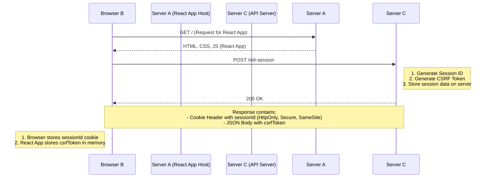
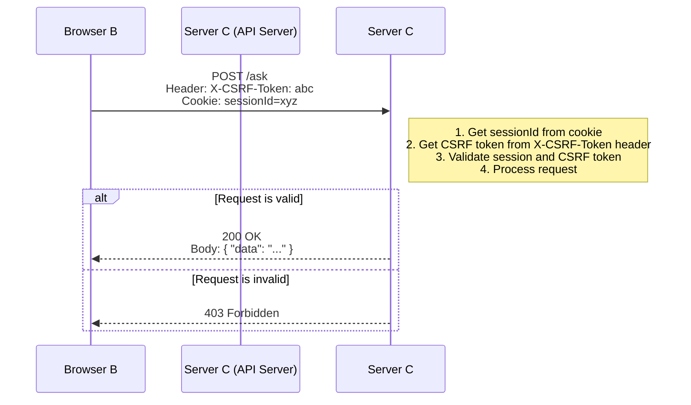

# Secure Session Flow: React Client and API Server

This document describes a secure session management flow for a system with a separate frontend and backend:

* **React Client:** Hosted on Server A, running in the user's Browser B.
* **API Server:** Running on Server C, with endpoints like `/init-session` and `/ask`.

The primary security goals of this flow are to prevent **Cross-Site Request Forgery (CSRF)** and **Man-in-the-Middle (MitM)** attacks.

---

## Session Initialization Flow

This flow outlines how a secure session is established when the user first loads the application.

### Explanation

1.  **Get React App:** The user's browser requests the React application from Server A. Server A responds with the application's static files (HTML, CSS, JS).
2.  **Initiate Session:** Once loaded, the React application makes a `POST` request to the `/init-session` endpoint on the API server (Server C).
3.  **Server C Responds:**
    * **Session ID Cookie:** Server C generates a unique session ID and sends it back in a `Set-Cookie` header. The cookie is configured for maximum security:
        * `HttpOnly`: Prevents the cookie from being accessed by client-side JavaScript, mitigating XSS attacks.
        * `Secure`: Ensures the cookie is only sent over an encrypted HTTPS connection.
        * `SameSite=Strict`: Prevents the browser from sending the cookie with any cross-site requests, providing strong CSRF protection.
    * **CSRF Token:** Server C also generates a unique CSRF token, associates it with the session ID, and sends it back in the JSON response body. The React app stores this token in memory (e.g., in a state variable).

---

## Subsequent API Request Flow (`/ask`)

This diagram shows how the browser uses the established session to make authenticated requests to protected endpoints.

### Explanation

1.  **Authenticated Request:** When the user performs an action that requires calling a protected endpoint like `/ask`, the React application constructs the request.
    * **Custom Header:** It includes the CSRF token (stored in memory) in a custom HTTP header, like `X-CSRF-Token`.
    * **Cookie:** The browser automatically attaches the `sessionId` cookie to the request because the request is being made to the API server's domain.
2.  **Server C Validation:** Upon receiving the request, the API server performs these critical validation steps:
    * It reads the `sessionId` from the cookie and the CSRF token from the `X-CSRF-Token` header.
    * It retrieves the expected CSRF token associated with the session ID from its server-side store.
    * It compares the token from the header with the expected token.
    * If they match, the request is valid, and the server processes it. If they don't match, it's a potential CSRF attack, and the server rejects the request with a `403 Forbidden` error.

---

## How This Design Provides Security

### CSRF Protection

This pattern is a variation of the "Double Submit Cookie" method. A malicious website can trick a user's browser into sending a request to your API, and that request will automatically include the `sessionId` cookie. However, the malicious site cannot read the CSRF token from your application's JavaScript memory due to the browser's **Same-Origin Policy**. Without the ability to include the correct `X-CSRF-Token` header, the forged request will fail the server's validation.

### Man-in-the-Middle (MitM) Protection

MitM attacks are prevented by enforcing HTTPS for all communication.
* **Encrypted Traffic:** HTTPS encrypts the entire request and response, including headers, cookies, and the request body. This prevents an attacker on the same network from eavesdropping on the communication to steal the session ID or CSRF token.
* **`Secure` Cookie Flag:** The `Secure` flag on the session cookie is a crucial instruction to the browser to *only* send the cookie over an HTTPS connection, preventing accidental leakage over an insecure HTTP connection.
