# Network Effects and Hiring Patterns in Tech: Analysis Summary

## Executive Summary

This analysis examines homophilic hiring patterns in the technology industry, focusing on how network effects create hierarchical "empire building" that can impact organizational diversity. The study contrasts traditional tech company demographics with AI research organizations to highlight how different institutional structures influence hiring outcomes.

## Key Findings

### Indian Representation in Traditional Tech
- Professionals of Indian origin hold leadership positions at rates exceeding their proportion of the U.S. population
- Significant presence spans from engineering roles to C-suite positions at major companies (Google, Microsoft, Adobe, IBM)
- Network effects create cascading hiring patterns across organizational hierarchies

### AI Research Demographic Contrast
- 65% of top 100 AI researchers globally are of Chinese origin
- 15-20% European/Western origin
- 10-15% other backgrounds (including Indian origin)
- Merit-based selection through academic achievement rather than network hiring

## Organizational Hierarchy and Empire Building

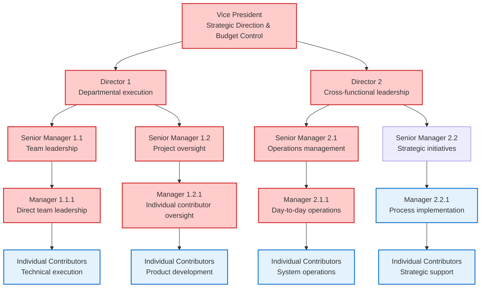

## Network Effect Mechanisms

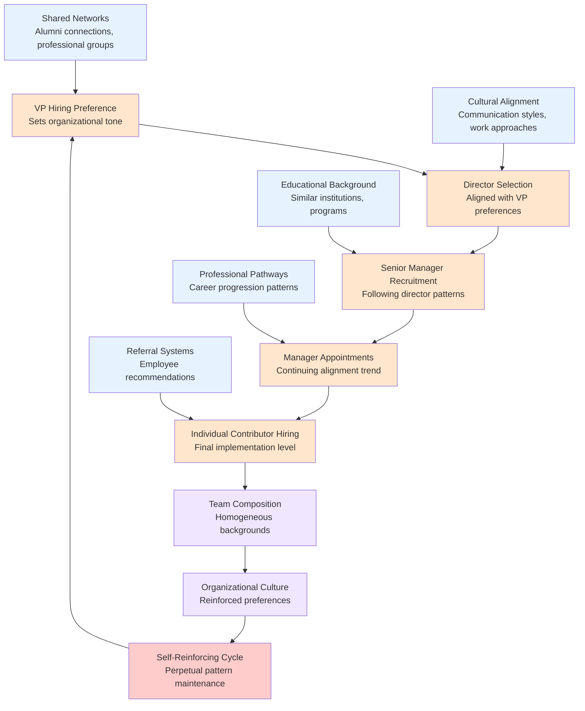

## Traditional Tech vs AI Research Comparison

```mermaid
graph TD
    subgraph TraditionalTech ["Traditional Tech Companies"]
        A1[Network-Based Hiring<br/>Referrals and cultural connections]
        A2[Cultural Fit Priority<br/>Team chemistry and communication]
        A3[Management Experience Valued<br/>Leadership and scaling skills]
        A4[Rapid Scaling Needs<br/>Fast hiring decisions]
        A5[Result: 65% Indian Origin<br/>Leadership Positions]
        
        A1 --> A2
        A2 --> A3
        A3 --> A4
        A4 --> A5
    end
    
    subgraph AIResearch ["AI Research Organizations"]
        B1[Merit-Based Selection<br/>Academic achievement focus]
        B2[Publication Record Priority<br/>Research impact and citations]
        B3[Technical Innovation Valued<br/>Scientific breakthroughs]
        B4[Selective Specialized Teams<br/>Elite researcher recruitment]
        B5[Result: 65% Chinese Origin<br/>Top Global Researchers]
        
        B1 --> B2
        B2 --> B3
        B3 --> B4
        B4 --> B5
    end
    
    classDef traditional fill:#ffe6cc,stroke:#ff9800,stroke-width:2px
    classDef research fill:#ccf2ff,stroke:#2196f3,stroke-width:2px
    classDef result fill:#ffcccc,stroke:#f44336,stroke-width:3px
    
    class A1,A2,A3,A4 traditional
    class B1,B2,B3,B4 research
    class A5,B5 result
```

## Demographic Distribution Patterns

### Traditional Tech Leadership
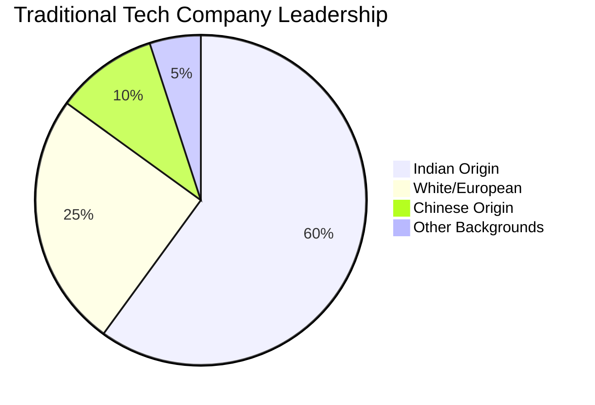

### AI Research Leadership
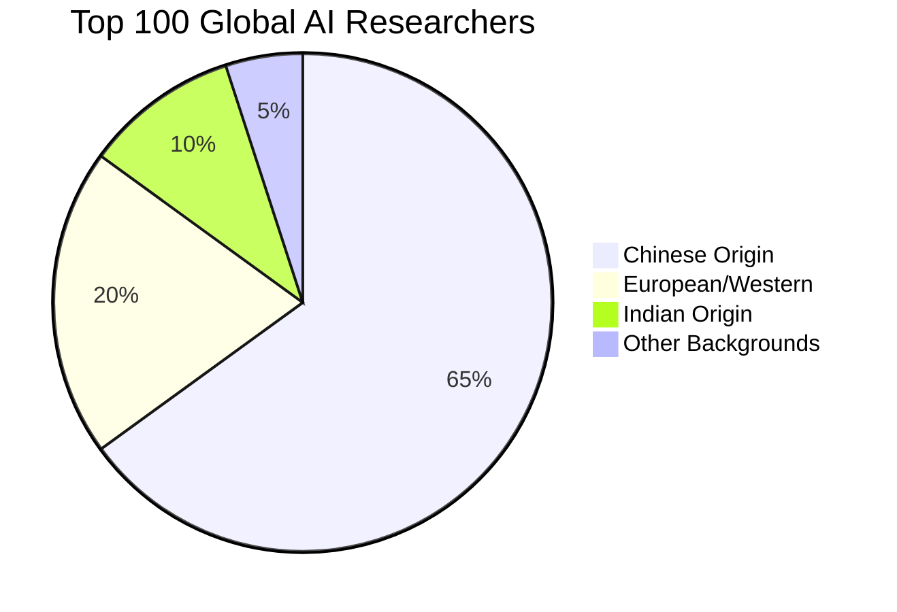

## Empire Building Motivations

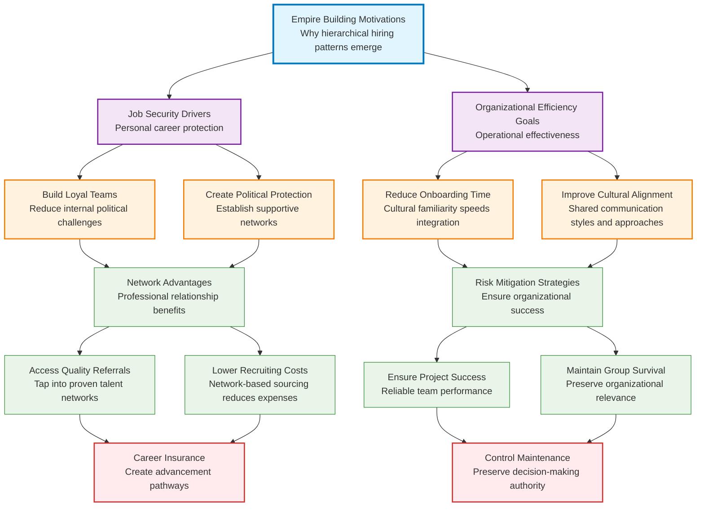

## Consequences and Impacts

### Organizational Effects

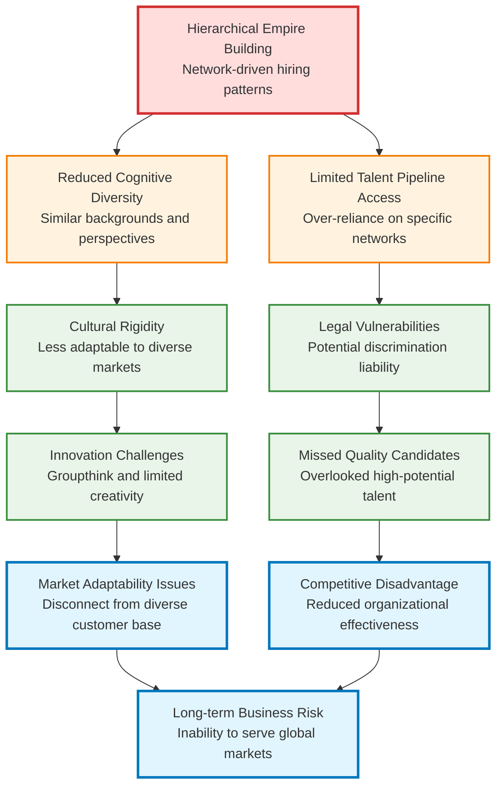

### Impact on Other Communities

- **Other Minority Groups**: Systematic exclusion from leadership opportunities
- **Women**: Additional barriers in male-dominated environments
- **African American/Hispanic**: Network-based hiring exclusion
- **Non-immigrant Professionals**: Lack of tight-knit professional networks

## Solutions and Mitigation Strategies

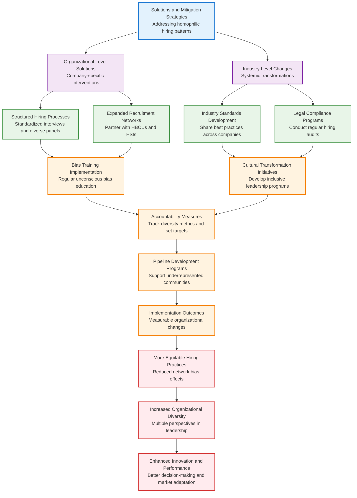

## Key Lessons from AI Research Model

### Merit-Based Success Factors

1. **Objective Criteria**: Publication records, citation counts, technical contributions
2. **Academic Networks**: Built on research collaboration rather than ethnic connections
3. **Institutional Structure**: Research-focused culture with clear performance metrics
4. **Global Competition**: Academic achievement transcends regional networks

### Transferable Strategies

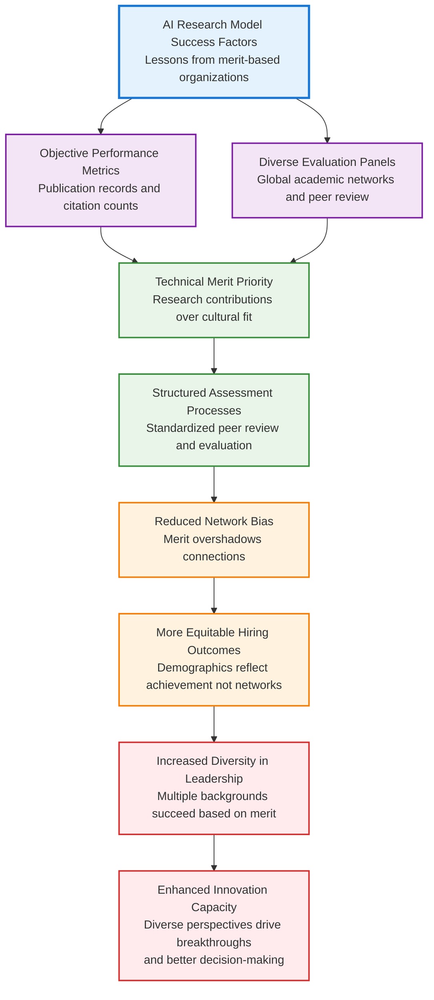

## Recommendations

### For Organizations
- Implement structured hiring processes with measurable criteria
- Expand recruitment networks beyond traditional sources
- Create accountability systems with diversity metrics
- Foster inclusive leadership development

### For Industry
- Establish best practice sharing across companies
- Develop industry standards for inclusive hiring
- Support pipeline development from underrepresented communities
- Promote transparency in hiring and promotion practices

### For Individuals
- Recognize and challenge unconscious bias
- Actively mentor across demographic lines
- Support inclusive team building
- Advocate for systematic fairness

## Evidence of Homophilic Hierarchy Building

The stark contrast between management and research roles provides compelling evidence of network-driven hiring patterns:

### The Smoking Gun: Same Talent Pool, Different Outcomes

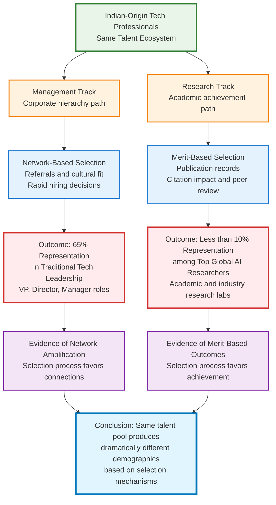

### Why This Proves Homophilic Hierarchy Building

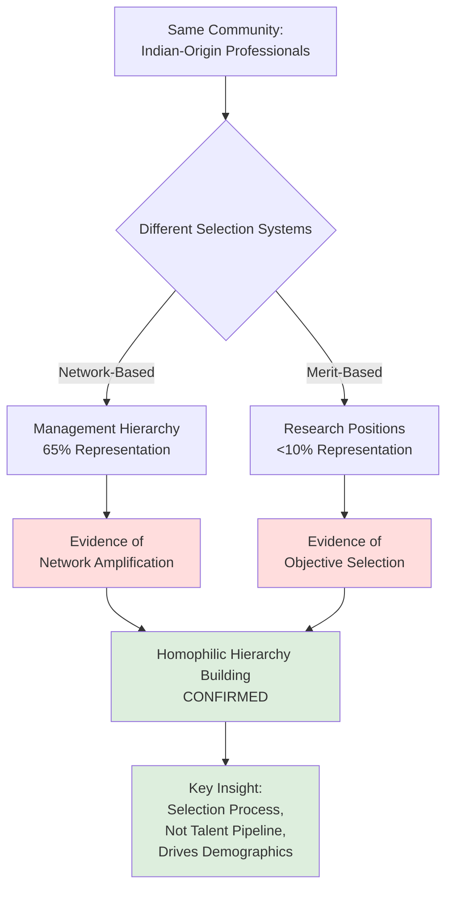

### The Natural Experiment Analysis

This comparison serves as a **natural experiment** that isolates the impact of selection mechanisms:

| Factor | Management Roles | Research Roles | Interpretation |
|--------|-----------------|----------------|----------------|
| **Talent Source** | Same ecosystem | Same ecosystem | Controls for pipeline |
| **Selection Method** | Network/Cultural fit | Academic merit | Key variable |
| **Outcome** | 65% representation | <10% representation | Dramatic difference |
| **Conclusion** | Network effects dominate | Merit-based selection | **Process drives demographics** |

### Three-Level Evidence Structure

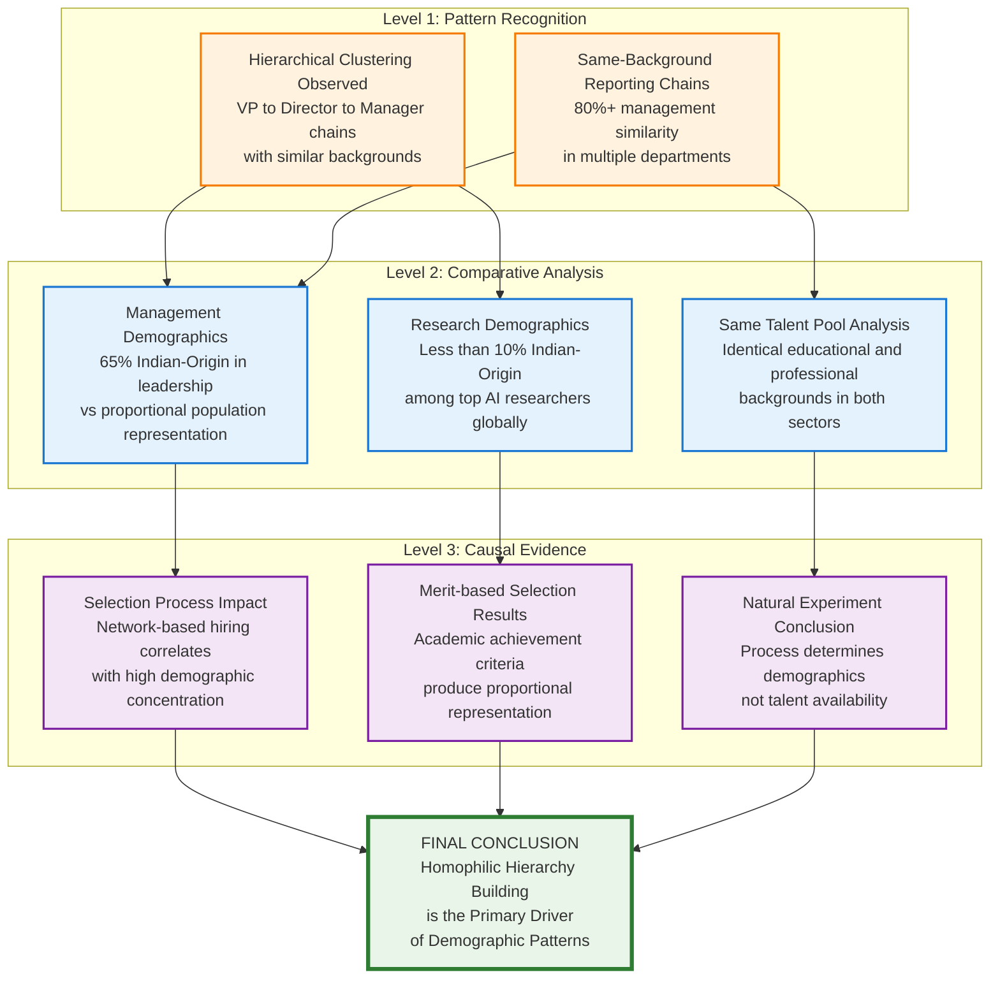

## Conclusion

The analysis reveals that hiring patterns in tech reflect complex interactions between individual preferences, organizational structures, and systemic factors. While network effects are natural, their amplification through hierarchical structures can create unintended consequences for organizational diversity.

**The smoking gun evidence** - where the same talent ecosystem produces 65% management representation but <10% research representation - definitively demonstrates that **selection processes, not talent availability, drive demographic outcomes**. This natural experiment isolates network effects as the primary mechanism creating homophilic hierarchy building in traditional tech companies.

The contrast between traditional tech companies and AI research organizations demonstrates that institutional design significantly influences demographic outcomes. Organizations that prioritize objective, merit-based criteria tend to produce more diverse leadership while maintaining high performance standards.

Success in addressing these challenges requires balanced approaches that harness network benefits while systematically expanding opportunities for talent from all backgrounds. This involves both individual awareness and organizational commitment to creating truly inclusive workplaces that attract and retain the best talent regardless of background.
