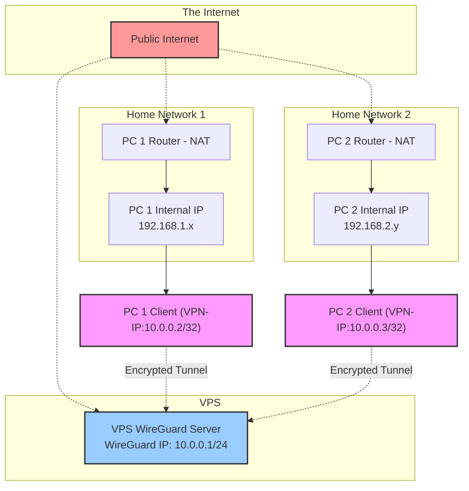

### Guide to Creating a Peer-to-Peer WireGuard VPN with a Central VPS

This guide provides a comprehensive, step-by-step process for setting up a WireGuard VPN. This configuration uses a low-cost Virtual Private Server (VPS) as a central rendezvous point to help two PCs, both behind NAT, find and connect to each other. Once the initial connection is established, data traffic between the PCs will flow directly, minimizing VPS bandwidth usage.

#### Prerequisites:

- A VPS running Oracle Linux.
  
- Two home PCs running Ubuntu.
  
- Administrative access (root or `sudo`) on all three machines.
  
- SSH access to the VPS.
  

### **Network Diagram**
Below is a visual representation of the network topology you are about to build.



### **Step 1: Generate Your Key Pairs**

You must generate a unique private and public key pair for each of the three machines. These keys are fundamental to WireGuard's security.

**On the VPS (Oracle Linux):**

1. Log in via SSH and install the `wireguard-tools` package:
  
  ```
  sudo dnf install -y wireguard-tools
  ```
  
2. Generate the key pair. The `umask` command ensures the private key is only readable by the root user.
  
  ```
  umask 077; wg genkey | tee /etc/wireguard/server_privatekey | wg pubkey > /etc/wireguard/server_publickey
  ```
  
3. Display and copy the public key. You will need this for the home PC configurations.
  
  ```
  sudo cat /etc/wireguard/server_publickey
  ```
  

**On each Home PC (Ubuntu):**

1. Log in to the PC and install the `wireguard` package.
  
  ```
  sudo apt update
  sudo apt install wireguard
  ```
  
2. Generate a unique key pair for this PC. Repeat this step for the second PC, giving the key files a different name (e.g., `pc1_privatekey`, `pc2_privatekey`).
  
  ```
  umask 077; wg genkey | tee /etc/wireguard/pc1_privatekey | wg pubkey > /etc/wireguard/pc1_publickey
  ```
  
3. Display and copy the public key. You will need this for the VPS configuration.
  
  ```
  sudo cat /etc/wireguard/pc1_publickey
  ```
  

### **Step 2: Configure the VPS**

Create the WireGuard configuration file at `/etc/wireguard/wg0.conf` on the VPS.

1. Open the file with a text editor:
  
  ```
  sudo nano /etc/wireguard/wg0.conf
  ```
  
2. Paste the following configuration, replacing the placeholders with the actual keys you generated and the public network interface name of your VPS.
  
  - **`PrivateKey`**: The private key for your VPS.
    
  - **`PublicKey`**: The public keys for your home PCs.
    
  - **`AllowedIPs`**: The virtual IP addresses you have assigned to your PCs.
    

```
[Interface]
Address = 10.0.0.1/24
ListenPort = 51820
PrivateKey = <Paste_VPS_Private_Key_Here>
PostUp = iptables -A FORWARD -i %i -j ACCEPT; iptables -A FORWARD -o %i -j ACCEPT; iptables -t nat -A POSTROUTING -o <your_public_interface> -j MASQUERADE
PostDown = iptables -D FORWARD -i %i -j ACCEPT; iptables -D FORWARD -o %i -j ACCEPT; iptables -t nat -D POSTROUTING -o <your_public_interface> -j MASQUERADE

[Peer]
# PC 1
PublicKey = <Paste_PC1_Public_Key_Here>
AllowedIPs = 10.0.0.2/32

[Peer]
# PC 2
PublicKey = <Paste_PC2_Public_Key_Here>
AllowedIPs = 10.0.0.3/32
```

3. Save and exit the editor (`Ctrl+X`, then `Y`, then `Enter`).
  
4. Enable IP forwarding on the VPS. This allows the server to route traffic between the two PCs.
  
  ```
  sudo sysctl -w net.ipv4.ip_forward=1
  sudo sh -c "echo 'net.ipv4.ip_forward=1' >> /etc/sysctl.conf"
  ```
  
5. Open the WireGuard port (51820 UDP) on the VPS firewall.
  
  ```
  sudo firewall-cmd --permanent --add-port=51820/udp && sudo firewall-cmd --reload
  ```
  
6. Start the WireGuard service on the VPS.
  
  ```
  sudo systemctl start wg-quick@wg0
  sudo systemctl enable wg-quick@wg0
  ```
  

### **Step 3: Configure Home PC 1**

Create the WireGuard configuration file at `/etc/wireguard/wg0.conf` on the first home PC.

1. Open the file with a text editor:
  
  ```
  sudo nano /etc/wireguard/wg0.conf
  ```
  
2. Paste the following, replacing the placeholders with the correct keys and your VPS's public IP address.
  
  - **`PrivateKey`**: The private key for PC 1.
    
  - **`PublicKey`**: The public keys for both the VPS and PC 2.
    
  - **`Endpoint`**: The public IP and port of your VPS.
    
  - **`AllowedIPs`**: The IP addresses you want to be able to reach through the tunnel.
    

```
[Interface]
Address = 10.0.0.2/32
PrivateKey = <Paste_PC1_Private_Key_Here>

[Peer]
# The VPS
PublicKey = <Paste_VPS_Public_Key_Here>
Endpoint = <VPS_Public_IP>:51820
AllowedIPs = 10.0.0.1/32, 10.0.0.3/32
PersistentKeepalive = 25

[Peer]
# PC 2 (for peer-to-peer connection)
PublicKey = <Paste_PC2_Public_Key_Here>
AllowedIPs = 10.0.0.3/32
```

3. Save and exit.
  
4. Start the WireGuard service on PC 1.
  
  ```
  sudo systemctl start wg-quick@wg0
  sudo systemctl enable wg-quick@wg0
  ```
  

### **Step 4: Configure Home PC 2**

Create the WireGuard configuration file at `/etc/wireguard/wg0.conf` on the second home PC.

1. Open the file with a text editor:
  
  ```
  sudo nano /etc/wireguard/wg0.conf
  ```
  
2. Paste the following, replacing the placeholders with the correct keys and your VPS's public IP address.
  
  ```
  [Interface]
  Address = 10.0.0.3/32
  PrivateKey = <Paste_PC2_Private_Key_Here>
  
  [Peer]
  # The VPS
  PublicKey = <Paste_VPS_Public_Key_Here>
  Endpoint = <VPS_Public_IP>:51820
  AllowedIPs = 10.0.0.1/32, 10.0.0.2/32
  PersistentKeepalive = 25
  
  [Peer]
  # PC 1 (for peer-to-peer connection)
  PublicKey = <Paste_PC1_Public_Key_Here>
  AllowedIPs = 10.0.0.2/32
  ```
  
3. Save and exit.
  
4. Start the WireGuard service on PC 2.
  
  ```
  sudo systemctl start wg-quick@wg0
  sudo systemctl enable wg-quick@wg0
  ```
  

### **Step 5: Verify the Connection**

After a few moments, the tunnels should be established.

On each machine, you can check the status with the following command:

```
sudo wg
```

- A successful connection will show an `endpoint` IP address and a `latest handshake` timestamp for your peers.
  
- Once connected, you should be able to ping one PC from the other using their virtual IP addresses (`10.0.0.2` and `10.0.0.3`).
  

Congratulations, you have successfully configured a peer-to-peer WireGuard VPN between your two home PCs!
